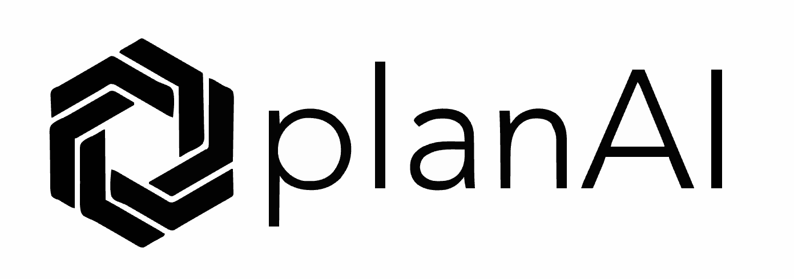
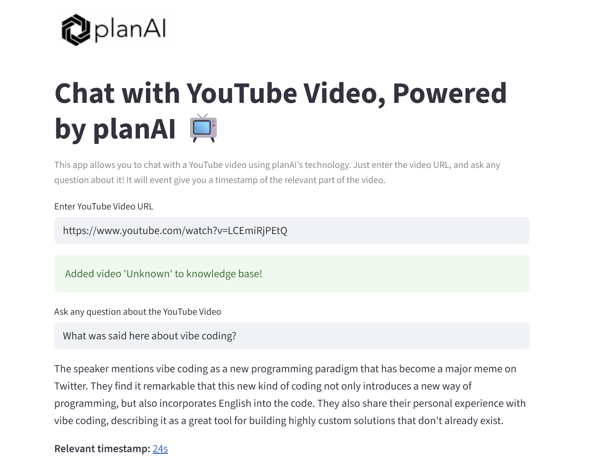

# 📽️ Chat with YouTube Videos — Powered by planAI

Interact with YouTube videos using Retrieval Augmented Generation (RAG) and OpenAI's GPT-4, with memory powered by mem0/embedchain and transcript extraction via youtube-transcript-api. This app is branded and powered by planAI technology.



## Features

- **planAI branding**: UI displays the planAI logo and branding.
- **No API key prompt**: The OpenAI API key is loaded automatically from a `.env` file.
- **Input a YouTube video URL**: Paste any YouTube video or Shorts URL.
- **Automatic transcript extraction**: The app fetches the transcript for the video.
- **Ask questions about the video**: Enter any question about the video content.
- **RAG-powered answers**: Answers are generated using the video transcript and OpenAI GPT-4.
- **Timestamped references**: The app finds and displays the most relevant timestamp in the video for your question, with a clickable link.
- **Modern Streamlit UI**: Clean, user-friendly interface.

## How to Get Started

1. **Clone the repository**

   ```bash
   git clone https://github.com/LabinotPllana1997/planAI_YouTube_llm_app.git
   ```

2. **Install dependencies**

   ```bash
   pip install -r requirements.txt
   ```

3. **Set up your OpenAI API Key**

   - Create a `.env` file in this directory with the following content:
     ```env
     OPENAI_API_KEY=your-openai-api-key-here
     ```
   - You can get your API key from [OpenAI](https://platform.openai.com/).

4. **Run the Streamlit App**

   ```bash
   streamlit run chat_youtube.py
   ```

## Usage

- The app will display the planAI logo and branding.
- Enter a YouTube video URL (supports both standard and Shorts URLs).
- The app will fetch the transcript and add it to the knowledge base.
- Ask any question about the video content.
- The answer will be generated using RAG and GPT-4, and a relevant timestamp will be shown as a clickable link.

## Example



- **Relevant timestamp:** [120s](https://www.youtube.com/watch?v=VIDEO_ID&t=120s)

## Troubleshooting

- If you see an error about the OpenAI API key, ensure your `.env` file exists and is in the same directory as `chat_youtube.py`.
- If the logo does not appear, make sure `planAI.png` is in the same directory as the script.
- If you get transcript errors, the video may not have a transcript available.

## Credits

- [planAI](https://planai.co) — AI technology and branding
- [embedchain](https://github.com/embedchain/embedchain)
- [youtube-transcript-api](https://github.com/jdepoix/youtube-transcript-api)
- [Streamlit](https://streamlit.io/)

---

© 2025 planAI. All rights reserved.
